# Projeto de Ciência de Dados — Agropecuária e transformação econômica do Ceará

**Links Rápidos:**
- 🌍 [Acessar Dashboard Publicado](https://projeto-ciencia-de-dados-unifor-j6ed4u7qczb4abxdceh56x.streamlit.app/)
- 🎥 [Assistir ao Vídeo no YouTube](URL_DO_YOUTUBE_AQUI)

Análise exploratória da agropecuária dos 184 municípios do Ceará e de sua relação com a estrutura econômica local, a partir de dados oficiais do IBGE/SIDRA: **Produção Agrícola Municipal (PAM)**, **Pesquisa da Pecuária Municipal (PPM)** e **Produto Interno Bruto dos Municípios (PIB)**. Período geral: **2003–2024** (PIB até 2023; Valor Adicionado Bruto até 2021).

---

## Sobre o projeto

O trabalho investiga como a produção agrícola e os efetivos pecuários dos municípios cearenses se transformaram entre 2003 e 2024 e como isso se relaciona com a estrutura econômica municipal nos períodos em que as bases têm dados em comum.

O relatório está organizado para separar a análise de cada base e, só depois, mostrar como agricultura, pecuária e economia se relacionam:

| Bloco | Objetivo |
|---|---|
| PAM | Entender área, produção, produtividade, valor econômico e especialização agrícola. |
| PPM | Entender o tamanho, a evolução e a distribuição territorial dos rebanhos. |
| Economia municipal | Entender Produto Interno Bruto, Valor Adicionado Bruto e peso da agropecuária. |
| Cruzamentos | Ver o que se relaciona entre PAM, PPM e estrutura econômica e o que não apresenta relação clara. |

**Nota metodológica:** valores monetários da PAM e do PIB/Valor Adicionado Bruto estão em **preços correntes (nominais)** e não foram corrigidos pela inflação. Correlação indica **associação, não causalidade**.

---

## Fontes e inventário dos dados

Todas as bases são recortes oficiais do SIDRA/IBGE e abrangem **Brasil**, **Ceará** e os **184 municípios cearenses**. A proveniência de cada arquivo (URL da API, filtros, hash) está em [`dados/fontes.csv`](dados/fontes.csv); as regras de interpretação estão em [`dados/README_DADOS.md`](dados/README_DADOS.md).

| Tabela SIDRA | Base | Conteúdo | Período | Linhas | Colunas |
|---|---|---|---|---|---:|---:|
| 5457 | PAM | 7 culturas × 5 variáveis | 2003–2024 | 143.220 | 13 |
| 3939 | PPM | Efetivo de 5 rebanhos | 2003–2024 | 20.460 | 13 |
| 5938 | PIB dos Municípios | PIB, VAB total, VAB agropecuário e participação | 2003–2023 (VAB até 2021) | 15.624 | 11 |

- **PAM — produtos:** milho, feijão, mandioca, cana-de-açúcar, banana, castanha de caju e melão.
- **PAM — variáveis:** área plantada (ha), área colhida (ha), quantidade produzida (t), rendimento médio (kg/ha) e valor da produção (mil R$).
- **PPM — espécies:** bovinos, caprinos, ovinos, suínos (total) e galináceos (total). Unidade: **cabeças**.
- **PIB — variáveis:** PIB a preços correntes (mil R$), VAB total (mil R$), VAB da agropecuária (mil R$), participação da agropecuária no VAB total (%).
- **Malha municipal:** GeoJSON do IBGE (Ceará, 2022), dado geográfico auxiliar ligado pela chave `codarea` (código IBGE de 7 dígitos).

---

## Estrutura do repositório

```
.
├── app/            # Dashboard Streamlit
│   ├── app.py          # Roteador (st.navigation) e filtros globais
│   ├── data.py         # Camada de dados e indicadores
│   ├── insights.py     # Achados calculados (correlações, rankings, líderes)
│   ├── comum.py        # Cache, estilo e elementos compartilhados
│   ├── test_data.py    # Testes do cálculo de valor bruto por hectare
│   └── views/          # As oito telas do dashboard
├── dados/
│   ├── raw/            # Dados originais do SIDRA/IBGE + malha municipal
│   ├── processed/      # Dados tratados (saída do pipeline)
│   └── analytical/     # Base cruzada PAM x PPM x PIB
├── docs/           # Relatórios e documentos das análises
├── notebooks/      # Análises exploratórias (incluindo geoespaciais)
├── src/            # Pipeline de preparação e scripts das análises
└── requirements.txt
```

---

## Pipeline de preparação de dados

O pipeline em `src/` lê os dados brutos, remove duplicatas pelas chaves oficiais, trata os símbolos de ausência do IBGE e padroniza colunas e categorias:

- `src/data_loader.py`: leitura dos dados brutos (PAM, PPM, PIB) preservando códigos como texto.
- `src/data_cleaner.py`: remoção de registros duplicados.
- `src/data_standardizer.py`: tratamento de símbolos e padronização.
- `src/pipeline.py`: orquestra leitura, limpeza e padronização, e salva os dados tratados.
- `src/cruzamento_bases.py`: cruza PAM, PPM e PIB pelo código do município.

**Tratamento dos símbolos:** `-` e `0` viram zero observado; `..` e `...` viram vazio; `X` (sigilo) viraria vazio com a marca `valor_is_inibido`. A chave de integração é sempre o **código IBGE do município (7 dígitos)** — nunca o nome. O diagnóstico e as decisões estão em [`docs/relatorio_preparacao_dados.md`](docs/relatorio_preparacao_dados.md) e [`docs/relatorio_tratamento_dados.md`](docs/relatorio_tratamento_dados.md).

```bash
python src/pipeline.py
```

Os dados tratados são salvos em `dados/processed/` e a base cruzada em `dados/analytical/`.

---

## 1. Análise exploratória — PAM (Agricultura)

### Inventário

| Característica | Resultado |
|---|---|
| Período | 2003–2024 (22 anos) |
| Municípios do Ceará | 184 |
| Produtos analisados | 7 |
| Variáveis analisadas | 5 |
| Linhas | 143.220 |
| Colunas | 13 |
| Duplicatas | 0 |
| Valores ausentes após tratamento | 0 |

Cada variável conta uma história diferente: **hectares** mostram uso da terra; **toneladas** mostram volume físico; **kg/ha** mostram produtividade; e o **valor da produção** mostra a dimensão econômica bruta.

### Como estava a agricultura cearense em 2024?

| Pergunta | Resultado em 2024 | Leitura |
|---|---|---|
| Qual cultura ocupou mais área? | Milho — 572.432 ha plantados | Maior ocupação de terra |
| Qual produziu mais toneladas? | Mandioca — 817.857 t | Maior volume físico |
| Qual teve maior rendimento médio? | Cana-de-açúcar — 62.998 kg/ha | Maior produção por hectare |
| Qual gerou maior valor? | Banana — R$ 905,3 mi | Liderança econômica |
| Qual usa pouca área e gera muito valor? | Melão — 2.487 ha colhidos e R$ 109,7 mi | Grande valor bruto por hectare |

**Valor da produção em 2024 e participação no total das sete culturas:**

| Produto | Valor da produção | Participação |
|---|---|---|
| Banana | R$ 905,3 mi | 29,8% |
| Mandioca | R$ 524,0 mi | 17,3% |
| Castanha de caju | R$ 472,0 mi | 15,6% |
| Milho | R$ 457,2 mi | 15,1% |
| Feijão | R$ 443,3 mi | 14,6% |
| Cana-de-açúcar | R$ 123,0 mi | 4,1% |
| Melão | R$ 109,7 mi | 3,6% |


### Mais terra significa mais valor?

**Não.** Em 2024, o milho ocupou **572.432 ha** plantados, produziu **398.661 t** e gerou **R$ 457,2 mi**. A banana ocupou **37.612 ha**, produziu **481.841 t** e gerou **R$ 905,3 mi**. Ou seja, a banana usou cerca de **15 vezes menos área** que o milho, mas produziu mais toneladas e gerou quase o **dobro** do valor bruto.

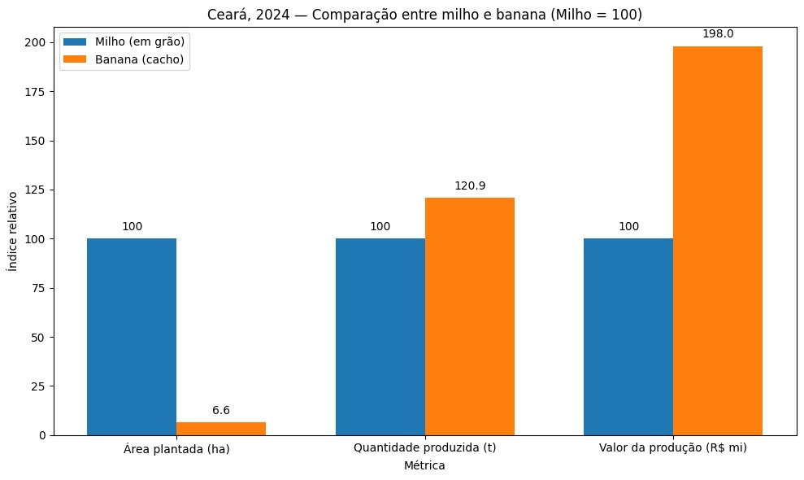

### Valor bruto da produção por hectare colhido

Métrica derivada: **valor da produção ÷ área colhida**. Não representa lucro, pois a base não informa custos, e não é o mesmo que rendimento físico (kg/ha).

| Cultura | Área colhida | Valor da produção | Valor bruto por ha |
|---|---:|---:|---:|
| Melão | 2.487 ha | R$ 109,7 mi | **R$ 44,1 mil/ha** |
| Banana | 37.577 ha | R$ 905,3 mi | R$ 24,1 mil/ha |
| Cana-de-açúcar | 8.828 ha | R$ 123,0 mi | R$ 13,9 mil/ha |
| Mandioca | 74.423 ha | R$ 524,0 mi | R$ 7,0 mil/ha |
| Castanha de caju | 282.602 ha | R$ 472,0 mi | R$ 1,67 mil/ha |
| Feijão | 346.245 ha | R$ 443,3 mi | R$ 1,28 mil/ha |
| Milho | 572.172 ha | R$ 457,2 mi | R$ 799/ha |

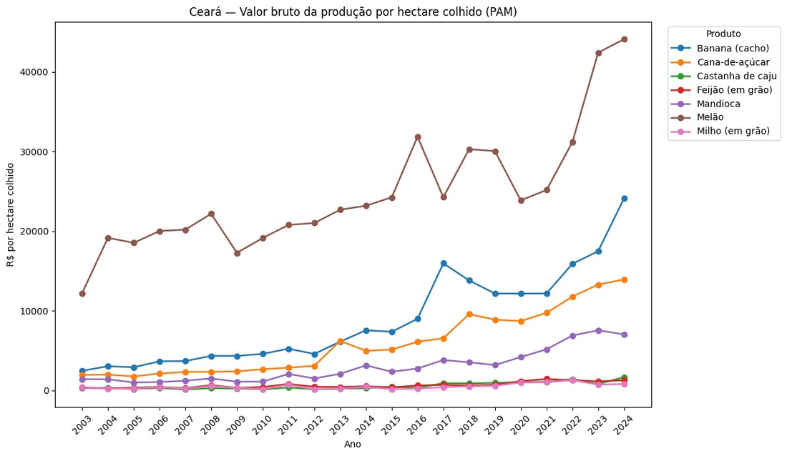

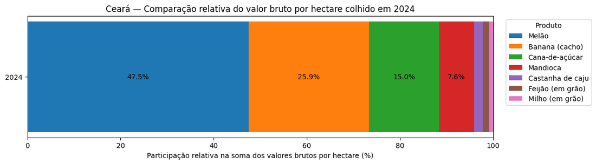

Ter mais hectares não significa gerar mais valor: em 2024 o **melão** teve o maior valor bruto por hectare colhido.

### Área plantada × área efetivamente colhida (milho)

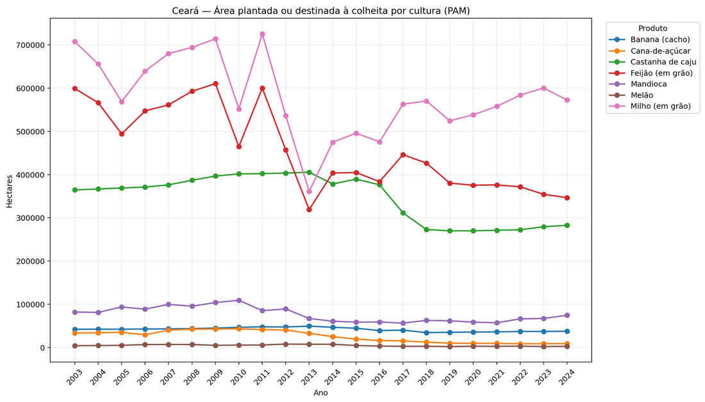

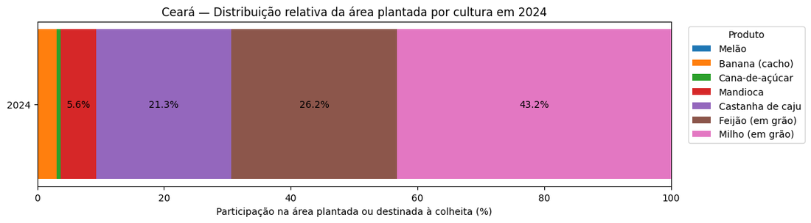

| Ano | Área plantada | Área colhida | Não convertida em colheita | Diferença relativa |
|---|---:|---:|---:|---:|
| 2008 | 694.054 ha | 675.480 ha | 18.574 ha | 2,68% |
| 2009 | 714.034 ha | 691.632 ha | 22.402 ha | 3,14% |
| 2012 | 535.959 ha | 497.598 ha | 38.361 ha | 7,16% |

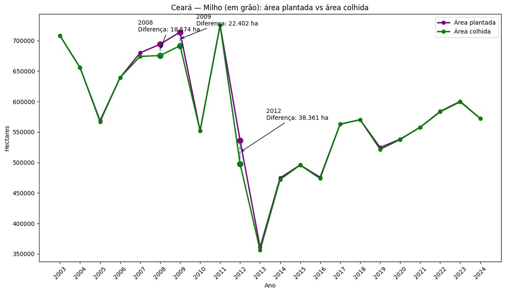

**Cuidado:** a base mostra a diferença entre área plantada e colhida, mas **não informa a causa**. É mais correto falar em "área que não se converteu em colheita" do que assumir perda por um fator específico.

### Especialização territorial

Para cada município foi identificada a **cultura de maior valor da produção** entre as sete. Em 2024, os municípios líderes por cultura foram:


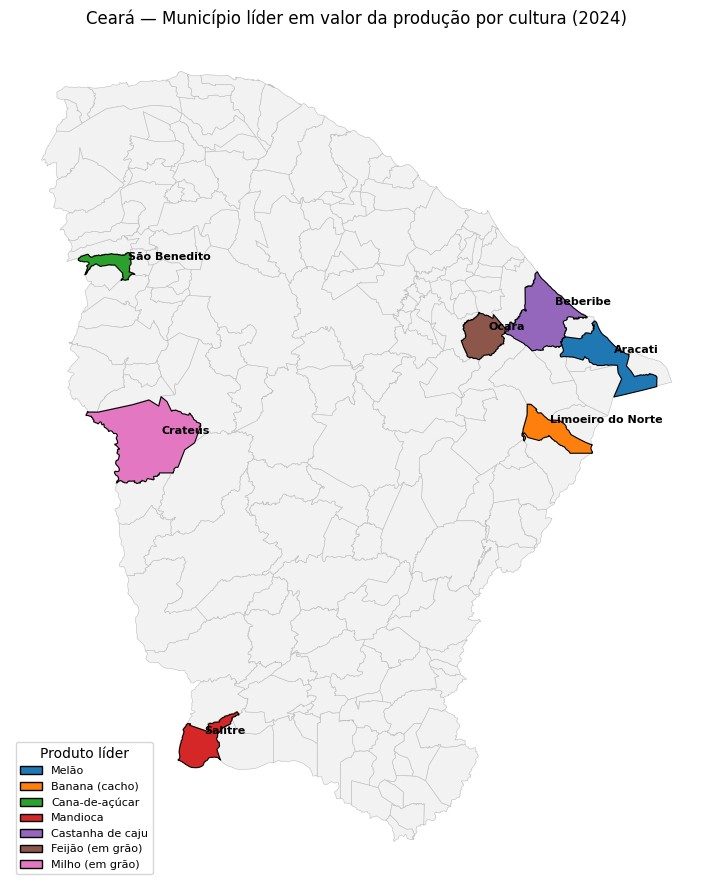

| Produto | Município líder | Valor da produção |
|---|---|---:|
| Banana | Limoeiro do Norte | R$ 165,1 mi |
| Mandioca | Salitre | R$ 107,9 mi |
| Castanha de caju | Beberibe | R$ 70,7 mi |
| Melão | Aracati | R$ 52,2 mi |
| Cana-de-açúcar | São Benedito | R$ 36,4 mi |
| Feijão | Ocara | R$ 32,3 mi |
| Milho | Crateús | R$ 24,4 mi |

### Perguntas e insights da PAM

- **Qual cultura ocupou mais área em 2024?** Milho, com 572.432 ha plantados.
- **Qual teve maior rendimento médio?** Cana-de-açúcar, com 62.998 kg/ha.
- **Qual gerou maior valor?** Banana, com R$ 905,3 milhões.
- **Ter mais área significa gerar mais valor?** Não. O milho ocupa muito mais área, mas a banana gera quase o dobro do valor bruto.
- **Qual cultura gera mais valor bruto por hectare colhido?** Melão, com cerca de R$ 44,1 mil/ha.
- **Toda área plantada de milho chega à colheita?** Não. Em 2012 a diferença foi de 38.361 ha.

**Insights:** a banana é a cultura de maior valor econômico; o milho usa mais terra mas não lidera em valor; o melão tem pouca área e o maior valor por hectare; área, quantidade, rendimento e valor contam histórias diferentes; e há forte **especialização territorial**.

---

## 2. Análise exploratória — PPM (Pecuária)

### Inventário

| Característica | Resultado |
|---|---|
| Período | 2003–2024 (22 anos) |
| Municípios do Ceará | 184 |
| Espécies analisadas | 5 |
| Linhas | 20.460 |
| Colunas | 13 |
| Valores ausentes | 0 |
| Duplicatas | 0 |
| Unidade | Cabeças |

A variável principal é o **efetivo dos rebanhos** (número de cabeças). Ela **não mede** faturamento, produção de carne, leite, ovos ou lucro.

### Como estava a pecuária cearense em 2024?

| Rebanho | Efetivo em 2024 |
|---|---:|
| Galináceos | 38,52 milhões |
| Bovinos | 2,86 milhões |
| Ovinos | 2,62 milhões |
| Suínos | 1,32 milhão |
| Caprinos | 1,14 milhão |


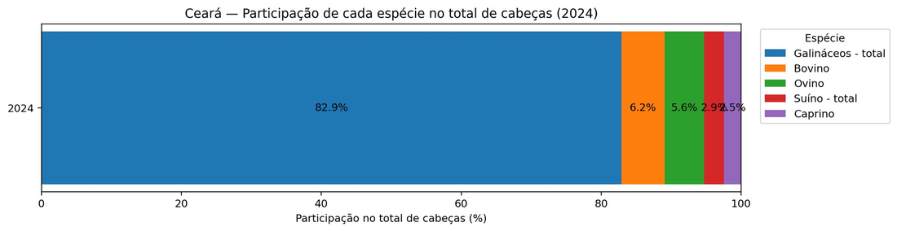

Os **galináceos** dominam o efetivo analisado, com cerca de **83%** das cabeças em 2024. A diferença de escala é tão grande que as demais espécies ficam comprimidas em gráficos absolutos.

### Distribuição territorial


| Espécie | 1º lugar | Cabeças | 2º lugar | Cabeças |
|---|---|---|---:|---|---:|
| Bovino | Morada Nova | 104.079 | Quixeramobim | 94.758 |
| Caprino | Tauá | 90.651 | Independência | 58.182 |
| Ovino | Tauá | 212.758 | Independência | 131.686 |
| Suíno | Viçosa do Ceará | 51.000 | Granja | 49.465 |
| Galináceos | Beberibe | 4.503.433 | Quixadá | 3.995.200 |

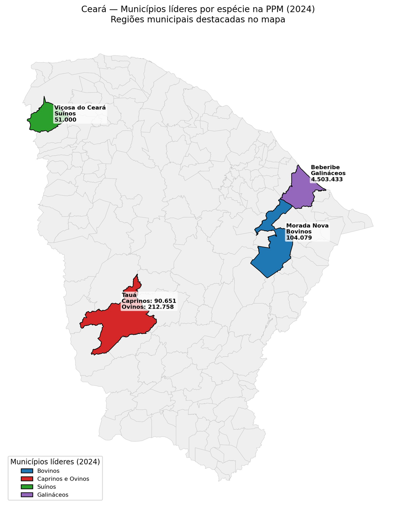

### Perguntas e insights da PPM

- **Qual é o rebanho mais numeroso?** Galináceos, com cerca de 38,5 milhões de cabeças em 2024.
- **Qual espécie mais cresceu entre 2003 e 2024?** Galináceos, cerca de **1,78×**; ovinos em segundo, com cerca de **1,47×**.
- **Quais municípios se destacam?** Tauá em caprinos e ovinos, Morada Nova em bovinos, Viçosa do Ceará em suínos e Beberibe em galináceos.

**Insights:** galináceos dominam a escala absoluta; ovinos e galináceos aparecem como rebanhos dominantes no mapa de 2024; e **mais cabeças não significa necessariamente mais dinheiro**.

---

## 3. Análise exploratória — Economia municipal (PIB/VAB)

### Inventário

| Característica | Resultado |
|---|---|
| Período do PIB | 2003–2023 |
| Período do Valor Adicionado Bruto | 2003–2021 |
| Municípios do Ceará | 184 |
| Linhas | 15.624 |
| Colunas | 11 |
| Duplicatas | 0 |
| Valores ausentes | 1.116 (VAB não disponível em 2022–2023) |

| Variável | Unidade | O que mostra |
|---|---|---|
| PIB a preços correntes | Mil R$ | Valor total produzido pela economia |
| VAB total | Mil R$ | Riqueza criada pelas atividades econômicas |
| VAB da agropecuária | Mil R$ | Riqueza criada pela agropecuária |
| Participação da agropecuária no VAB | % | Parcela da riqueza que veio da agropecuária |

### Evolução do PIB do Ceará

Entre 2003 e 2023, o PIB do Ceará passou de cerca de **R$ 32,7 bilhões** para **R$ 232,2 bilhões** — crescimento nominal de aproximadamente **7,1 vezes**. No mesmo período, o Brasil cresceu cerca de **6,37 vezes** (comparação indexada, 2003 = 100). Em valores absolutos, a linha do Ceará fica próxima da base, pois a economia brasileira é muito maior; por isso o gráfico indexado é o mais adequado para comparar ritmo.

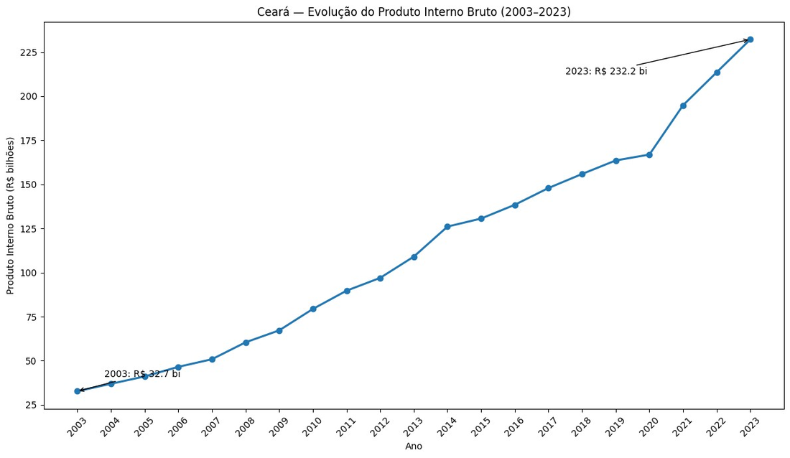


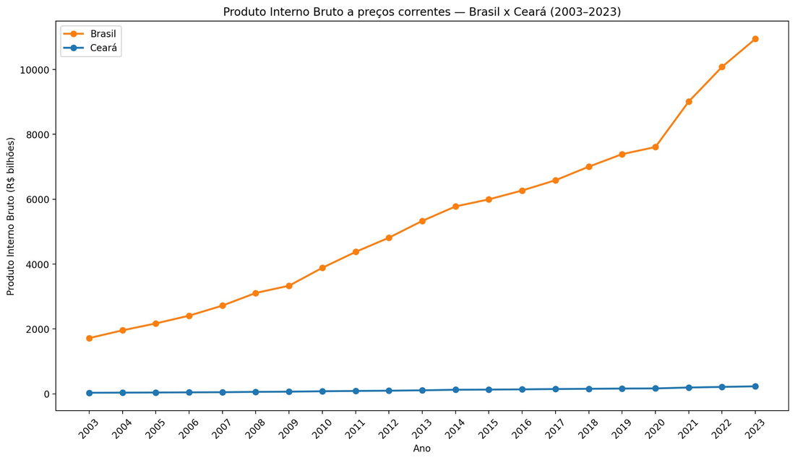

### Concentração e crescimento municipal

- **Maior PIB municipal:** Fortaleza, com cerca de **R$ 86,94 bilhões** em 2023 — muito acima dos demais.
- **Top 10 em crescimento proporcional (2003–2023):**

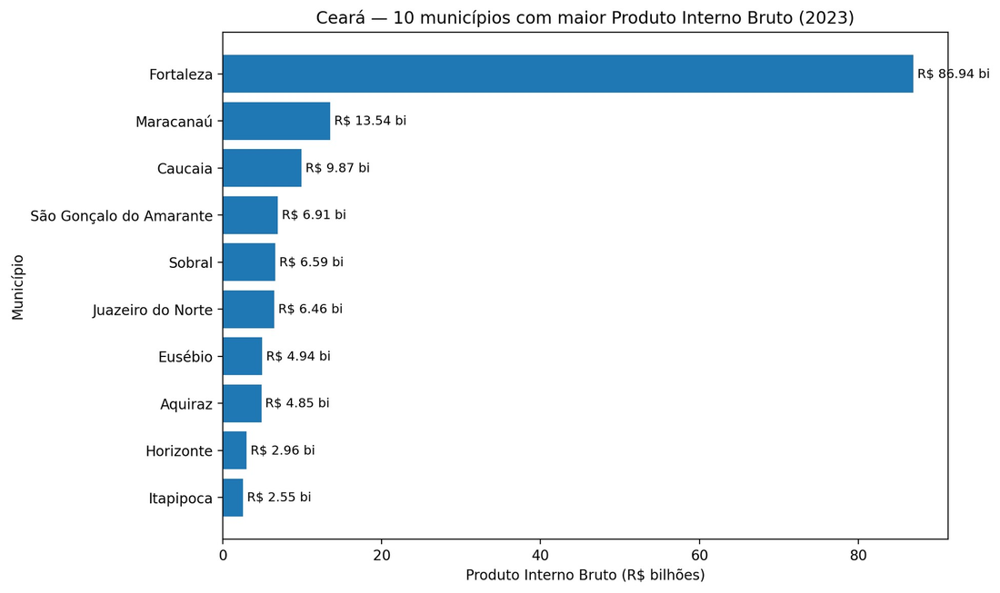

| # | Município | Fator | Crescimento |
|---|---|---|---:|
| 1 | São Gonçalo do Amarante | 70,0× | ≈ 6.897% |
| 2 | Itaitinga | 38,4× | ≈ 3.741% |
| 3 | Jijoca de Jericoacoara | 26,6× | ≈ 2.558% |
| 4 | Pereiro | 21,8× | ≈ 2.078% |
| 5 | Aquiraz | 17,8× | ≈ 1.678% |
| 6 | Frecheirinha | 16,2× | ≈ 1.521% |
| 7 | Uruoca | 14,0× | ≈ 1.304% |
| 8 | Cruz | 13,9× | ≈ 1.292% |
| 9 | Quixeré | 11,8× | ≈ 1.084% |
| 10 | Beberibe | 11,5× | ≈ 1.054% |

Fator = valor de 2023 ÷ valor de 2003; percentual = (fator − 1) × 100.

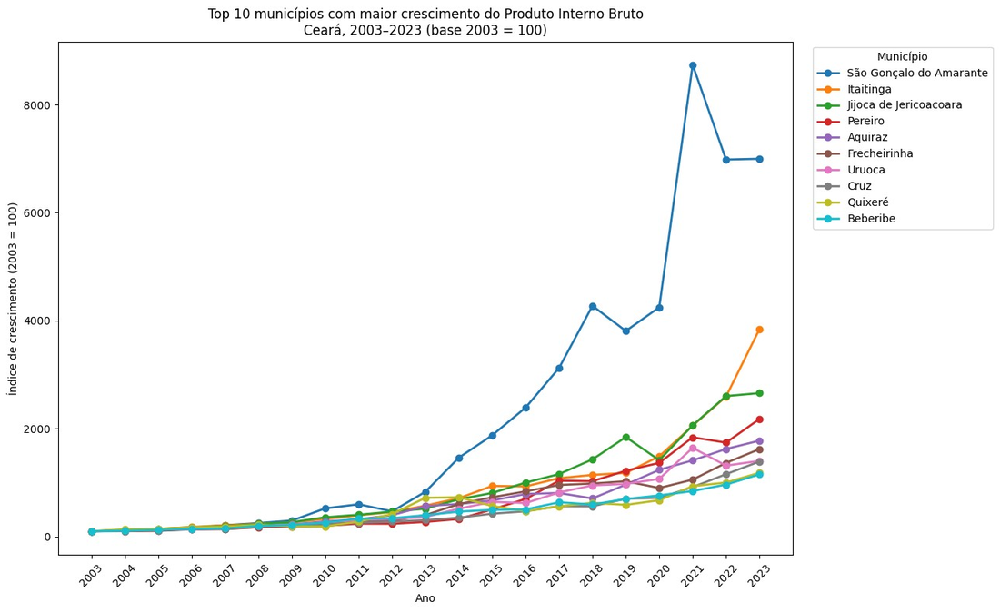

### Valor Adicionado Bruto e peso da agropecuária

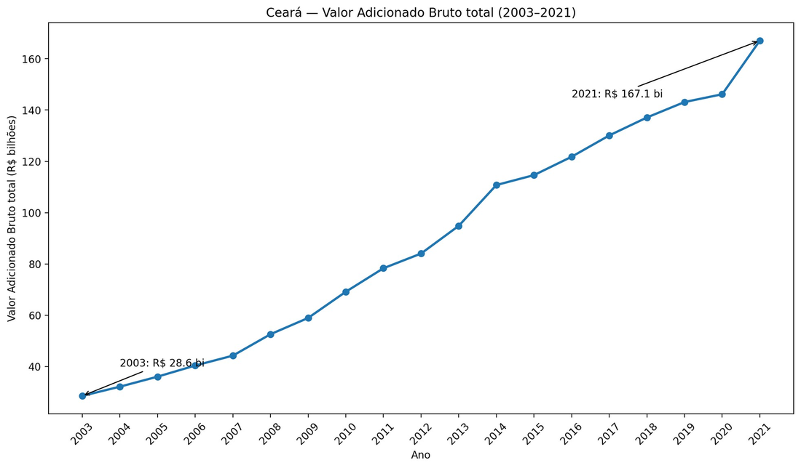

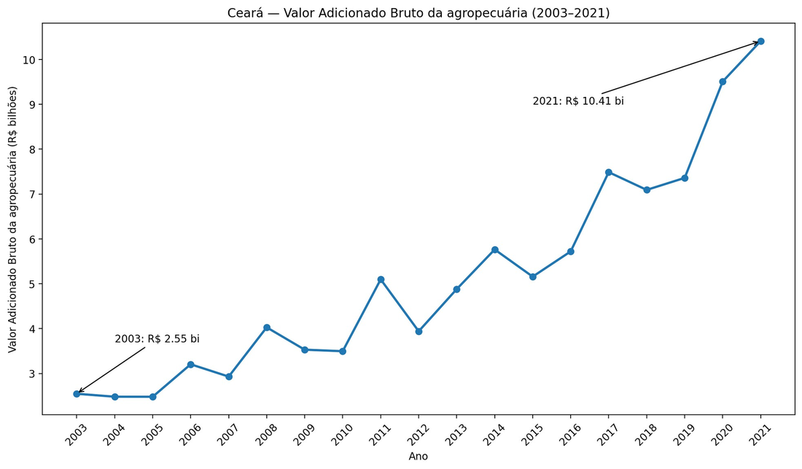

- O **VAB total** do Ceará passou de cerca de **R$ 28,6 bilhões** (2003) para **R$ 167,1 bilhões** (2021) — cerca de **5,84×** nominal.
- Em 2021, o **VAB da agropecuária** atingiu cerca de **R$ 10,41 bilhões**, com série mais oscilante que o total.
- Composição em 2021: **agropecuária 6,23%** e **demais atividades 93,77%**.
- **Municípios com maior participação agropecuária em 2021:** São João do Jaguaribe (44,83%), Milhã (42,88%), Varjota (42,83%), Missão Velha (40,04%), Guaraciaba do Norte (40,00%), Independência (38,51%), Beberibe (36,49%), Quixelô (35,67%), Aratuba (35,14%) e Croatá (34,69%).

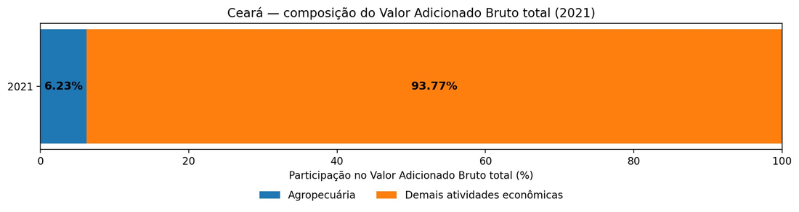


### São Gonçalo do Amarante

É o maior destaque de crescimento proporcional do PIB. O padrão da base mostra que esse crescimento **não foi puxado pela agropecuária**: a participação da indústria no VAB aumentou fortemente, enquanto a participação agropecuária caiu para **0,7% em 2021**. Esse padrão é compatível com a transformação industrial associada ao Complexo do Pecém (contexto externo; as bases não demonstram causalidade).

### Perguntas e insights da economia

- **Como o PIB do Ceará evoluiu?** De R$ 32,7 bi para R$ 232,2 bi, cerca de 7,1× nominal.
- **O Ceará cresceu mais que o Brasil?** Sim, na comparação nominal indexada: ~7,1× contra ~6,37×.
- **Qual município concentra mais atividade?** Fortaleza, ~R$ 86,94 bi em 2023.
- **Qual mais cresceu?** São Gonçalo do Amarante, ~70× entre 2003 e 2023.
- **Quanto da riqueza veio da agropecuária em 2021?** Cerca de 6,23% do VAB total.
- **Quais municípios têm maior peso agropecuário?** São João do Jaguaribe, Milhã, Varjota, Missão Velha e Guaraciaba do Norte.

**Insights:** forte crescimento nominal (não corrigido pela inflação); Fortaleza concentra a atividade estadual; o crescimento é desigual; a agropecuária é pequena no total estadual, mas pesa muito em alguns municípios do interior; e **PIB alto não significa economia agropecuária forte**.

---

## 4. Cruzamento das bases — PAM × PPM × economia

O cruzamento observa se os municípios que se destacam em uma dimensão também se destacam em outra. Como o Valor Adicionado Bruto termina em **2021**, esse é o principal ano de referência. As bases são integradas pela chave **`territorio_codigo` + `ano`**.

### Como ler as correlações (Spearman)

| Valor aproximado | Leitura |
|---|---|
| Próximo de 0 | Praticamente sem relação monotônica |
| 0,2 a 0,4 | Relação fraca |
| 0,4 a 0,6 | Relação moderada |
| 0,6 a 0,8 | Relação forte |
| Próximo de 1 | Relação muito forte |

Correlação mostra **associação**, não prova que uma variável causa a outra.

### 4.1 PAM × VAB da agropecuária

Somando o valor das sete culturas por município, a correlação de Spearman com o VAB da agropecuária em 2021 foi de **≈ 0,75** — associação positiva forte. O padrão **não aparece só em 2021**: ao longo de 2003–2021 a relação permaneceu forte e, na soma estadual, as **variações anuais** das duas séries tiveram correlação de **≈ 0,97**.


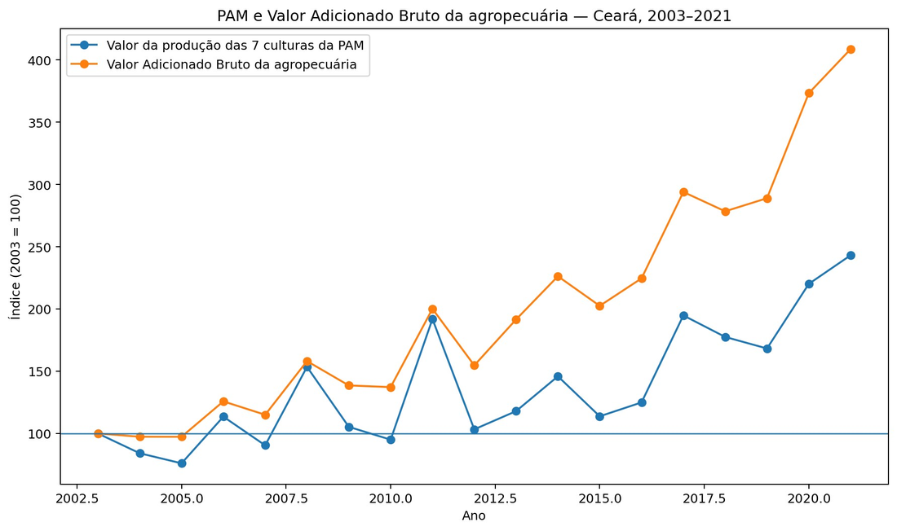

*Cuidado:* valor da produção da PAM e VAB são conceitos diferentes, e a PAM do projeto contém apenas sete culturas.

### 4.2 PPM × VAB da agropecuária (2021)

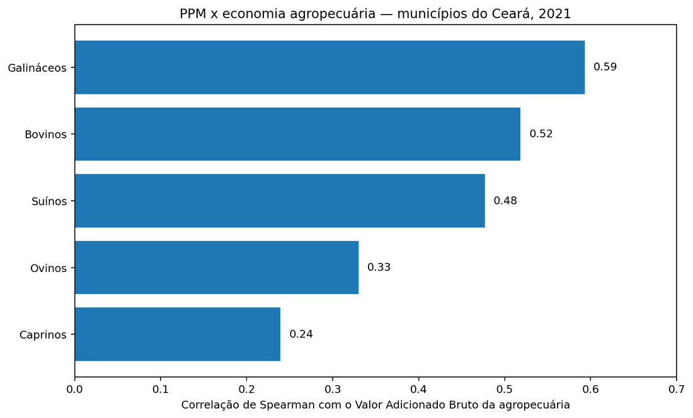

| Rebanho | Spearman |
|---|---:|
| Galináceos | 0,59 |
| Bovinos | 0,52 |
| Suínos | 0,48 |
| Ovinos | 0,33 |
| Caprinos | 0,24 |

Há relação positiva, principalmente para galináceos, bovinos e suínos, mas **menor** que a observada entre o valor da produção agrícola e o VAB agropecuário. Ter mais animais tende a acompanhar uma economia agropecuária maior, mas o número de cabeças sozinho não explica o tamanho econômico.

### 4.3 PAM × PPM (2021) — área plantada × efetivo

| Cultura × rebanho | Spearman |
|---|---:|
| Milho × Bovinos | 0,61 |
| Milho × Ovinos | 0,55 |
| Feijão × Ovinos | 0,54 |
| Feijão × Caprinos | 0,53 |
| Feijão × Bovinos | 0,49 |
| Feijão × Suínos | 0,49 |


Milho e feijão aparecem com frequência nos mesmos municípios em que os rebanhos de bovinos, ovinos e caprinos são maiores — perfis territoriais semelhantes, **não causalidade**.

### 4.4 Relações que praticamente não apareceram

O **melão** apresentou correlações próximas de **zero** com quase todos os rebanhos. Nem todas as atividades agrícolas compartilham o mesmo padrão territorial da pecuária — e **encontrar ausência de relação também é um resultado relevante**.

### 4.5 Produção × participação da agropecuária

Em 2021, a correlação entre o valor das sete culturas e a **participação da agropecuária** no VAB total foi de **≈ 0,33** — associação fraca. Produzir muito não significa que a agropecuária tenha grande peso na economia municipal.

| Município | Participação agropecuária | VAB agropecuário |
|---|---:|---:|
| São João do Jaguaribe | 44,83% | R$ 46,7 mi |
| Beberibe | 36,49% | R$ 370,2 mi |
| Fortaleza | 0,18% | R$ 107,1 mi |

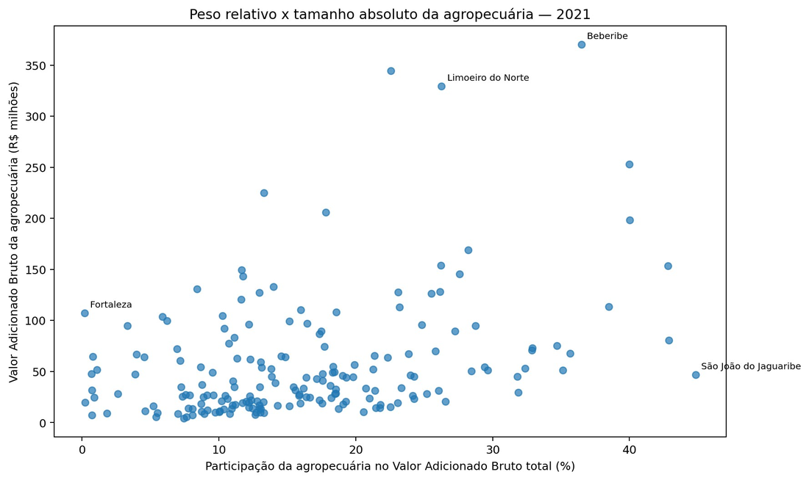

São João do Jaguaribe é proporcionalmente mais ligado à agropecuária; Beberibe, porém, gera muito mais riqueza agropecuária em valor absoluto. **Participação percentual e tamanho absoluto são dimensões diferentes.**

### 4.6 PIB total × agropecuária

Municípios com PIB alto não são necessariamente grandes economias agropecuárias:

| Caso | Leitura |
|---|---|
| Fortaleza | Em 2021, PIB de ~R$ 73,4 bi e participação agropecuária de apenas 0,18%. |
| São Gonçalo do Amarante | Em 2021, participação agropecuária de ~0,67%; o forte crescimento não acompanha aumento do peso agropecuário. |

Para estudar a força econômica da agropecuária, o **VAB agropecuário e sua participação** são mais informativos que o PIB isoladamente.

### Perguntas e insights dos cruzamentos

- **Maior valor de produção agrícola está relacionado a maior riqueza agropecuária?** Sim, forte (~0,75 em 2021).
- **Rebanhos maiores estão relacionados a maior riqueza agropecuária?** Em parte; mais claro para galináceos, bovinos e suínos.
- **Agricultura e pecuária aparecem juntas?** Em alguns casos; milho e feijão têm as associações mais claras com rebanhos.
- **Toda cultura está relacionada à pecuária?** Não; o melão praticamente não tem relação com os rebanhos.
- **Produzir muito significa grande participação na economia?** Não; valor absoluto e participação percentual são medidas diferentes.
- **PIB alto significa município agropecuário?** Não; Fortaleza e São Gonçalo do Amarante são exemplos.

**Insight geral:** agricultura, pecuária e estrutura econômica se relacionam, mas **não de forma uniforme**. O valor da produção agrícola tem associação forte com a riqueza criada pela agropecuária, enquanto os rebanhos mostram relações mais moderadas. Além disso, **produzir muito não significa que a agropecuária represente grande parte da economia municipal**.

---

## Cuidados e limitações

- **Correlação não significa causalidade.**
- Valores monetários estão em **preços correntes** e não foram corrigidos pela inflação.
- O valor da produção da PAM é **valor bruto** — não é lucro e não é igual ao VAB.
- A PPM informa **número de cabeças**, não receita, carne, leite, ovos ou lucro.
- A PAM do projeto contém **apenas sete culturas**, portanto não representa toda a produção agrícola municipal.
- A diferença entre área plantada e colhida **não permite identificar, sozinha, a causa** da não conversão em colheita.
- As métricas de VAB vão **até 2021**, por isso 2021 é o principal ano de cruzamento completo.

### Resumo final

| Dimensão | Principal conclusão |
|---|---|
| Agricultura (PAM) | Área, quantidade, produtividade e valor econômico não caminham necessariamente juntos. |
| Pecuária (PPM) | Galináceos dominam em escala absoluta; diferentes regiões têm especializações pecuárias. |
| Economia municipal | PIB alto não significa peso agropecuário alto. |
| PAM × economia | Valor da produção agrícola tem associação forte com o VAB da agropecuária. |
| PPM × economia | Efetivos pecuários têm associação positiva, mas mais moderada, com a riqueza agropecuária. |
| PAM × PPM | Milho e feijão aparecem associados a diferentes rebanhos; o melão praticamente não mostra o mesmo padrão. |

---

## Dashboard

O dashboard interativo é um app **Streamlit** em `app/`, com oito telas:

1. **Visão geral** — contexto, indicadores e atalhos.
2. **Agricultura (PAM)** — evolução por cultura, área absoluta/percentual, valor bruto por hectare, área plantada × colhida e mapa de cultura dominante.
3. **Pecuária (PPM)** — efetivos por espécie, composição e mapa de rebanho dominante.
4. **Economia municipal (PIB)** — PIB, Ceará × Brasil, rankings, crescimento, VAB e caso São Gonçalo do Amarante.
5. **Território** — mapa, ranking e distribuição por espécie.
6. **Cruzamentos** — dispersões e correlações entre as bases.
7. **Sínteses** — destaques, perguntas e respostas e insights, com os valores **recalculados a partir dos dados**.
8. **Fontes e metodologia** — tabelas, cobertura temporal e limitações.

Os achados exibidos são calculados em tempo de execução (`app/insights.py`), sem números fixos no código. Todos os gráficos informam a fonte e separam associação de causalidade.

```bash
streamlit run app/app.py
```

---

## Como executar

```bash
# 1. (opcional) ambiente virtual
python -m venv .venv && source .venv/bin/activate

# 2. dependências
pip install -r requirements.txt

# 3. pipeline de preparação (raw -> processed) e cruzamento
python src/pipeline.py

# 4. dashboard
streamlit run app/app.py
```

## Requisitos

Principais dependências: `pandas`, `numpy` e `streamlit`.

---

## Autoria

Equipe 02 — Tema 2, Agropecuária e transformação econômica · disciplina de Ciência de Dados, Unifor. Fontes: IBGE/SIDRA (tabelas 5457, 3939 e 5938) e API de Malhas do IBGE.
