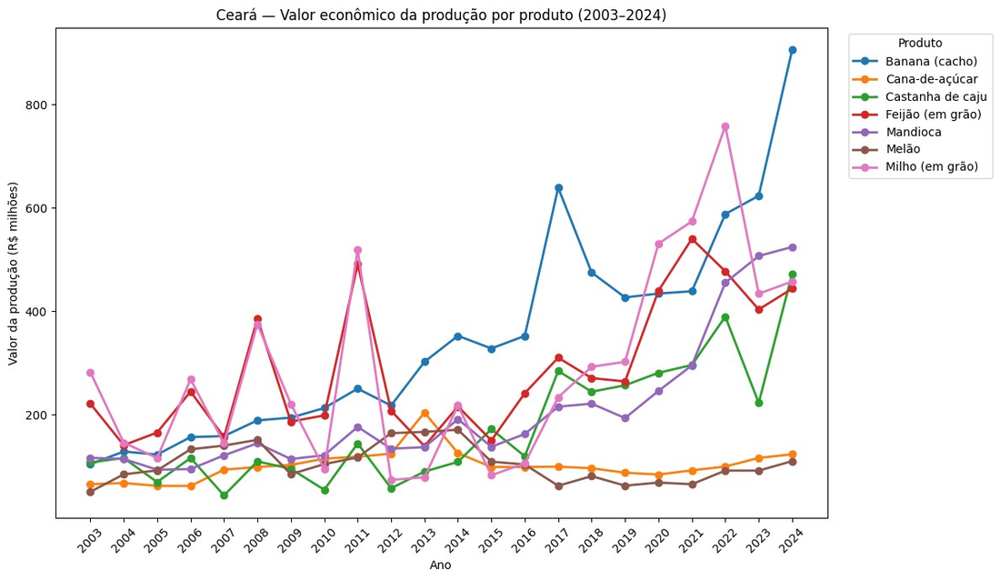
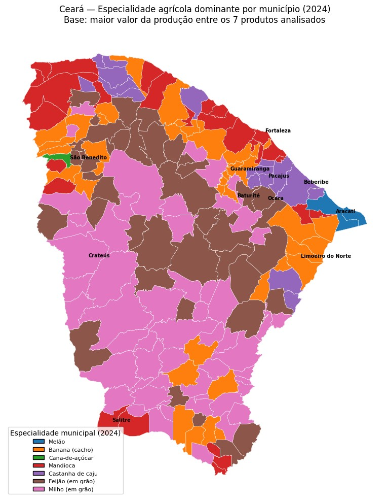
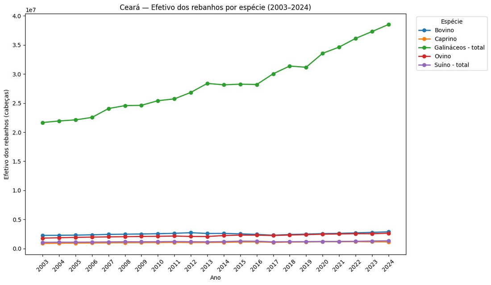
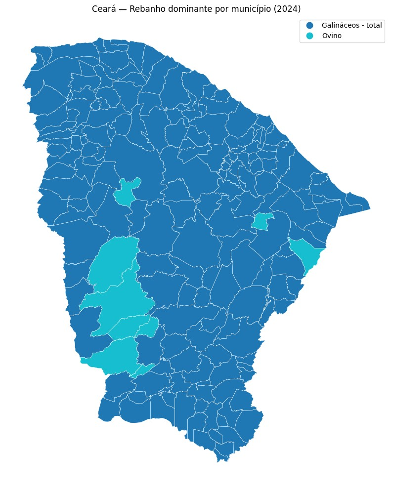
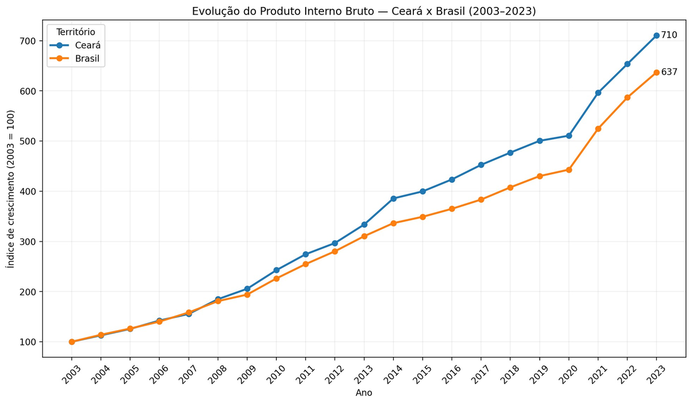
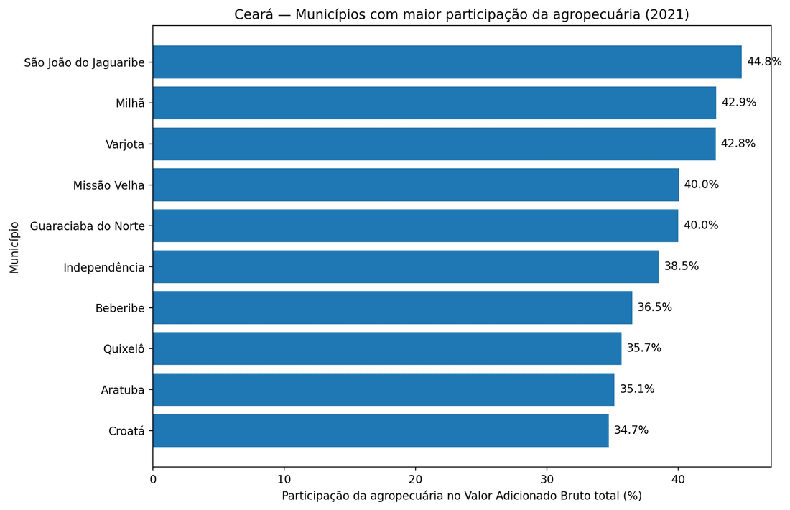
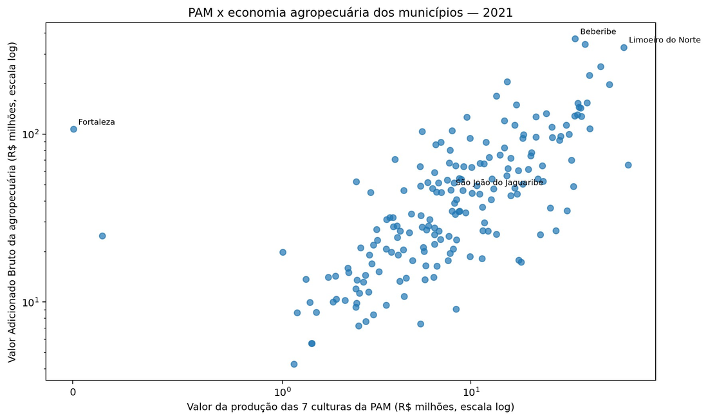
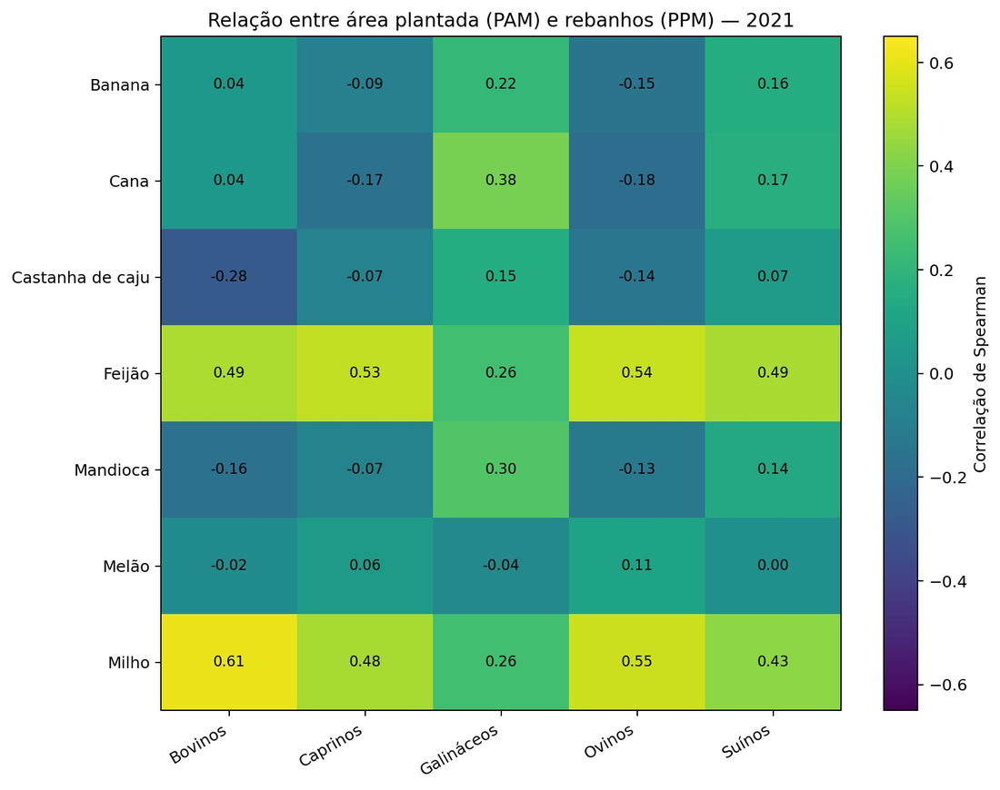

# Agropecuária e transformação econômica do Ceará

**Projeto 1 de Ciência de Dados | Tema 2 | Grupo C | Universidade de Fortaleza (Unifor)**

Este projeto investiga como a produção agrícola e os efetivos pecuários dos municípios cearenses se transformaram entre 2003 e 2024 e como essas mudanças se relacionam com a estrutura econômica municipal. A análise utiliza dados oficiais do Instituto Brasileiro de Geografia e Estatística (IBGE), disponibilizados pelo Sistema IBGE de Recuperação Automática (SIDRA), e reúne preparação reproduzível dos dados, análise exploratória, integração de bases e um dashboard interativo.

**Pergunta central:** Como o perfil agropecuário dos municípios cearenses se transformou entre 2003 e 2024 e como essas mudanças se relacionam com sua estrutura econômica?

O estudo considera os 184 municípios do Ceará. As séries físicas de agricultura e pecuária chegam a 2024, enquanto o PIB municipal está disponível até 2023 e as variáveis do Valor Adicionado Bruto (VAB), até 2021. Por isso, os cruzamentos respeitam os anos comuns às bases.

## Acesse o projeto

| Recurso | Acesso |
| :--- | :--- |
| Dashboard | [Explorar no Streamlit](https://projeto-ciencia-de-dados-unifor-j6ed4u7qczb4abxdceh56x.streamlit.app/) |
| Código e dados | [Repositório no GitHub](https://github.com/andradebyte/projeto-ciencia-de-dados-unifor) |
| Relatório de acompanhamento | [`docs/acompanhamento.pdf`](docs/acompanhamento.pdf) |
| Apresentação | [`docs/slides.pdf`](docs/slides.pdf)
| Vídeo extensionista | [Assistir no YouTube](https://www.youtube.com/watch?v=dtfjXmxma14) |


## 1. Objetivos e organização da análise

O objetivo é compreender as mudanças na agropecuária cearense e investigar como os perfis produtivos se relacionam com o tamanho e a composição das economias municipais. Os resultados permitem identificar diferenças territoriais que podem subsidiar novas investigações e discussões sobre planejamento regional. As associações observadas não estabelecem relações de causa e efeito.

O trabalho está organizado em quatro frentes complementares:

| Frente | Pergunta orientadora |
| :--- | :--- |
| Agricultura (PAM) | Como evoluíram a área, a produção, a produtividade e o valor das culturas selecionadas? |
| Pecuária (PPM) | Como os rebanhos evoluíram e se distribuíram pelos municípios? |
| Economia municipal (PIB e VAB) | Qual é o tamanho da economia municipal e qual é a participação da agropecuária? |
| Cruzamentos | Quais relações aparecem entre agricultura, pecuária e estrutura econômica? |

## 2. Fontes, cobertura e dicionário de dados

A pesquisa utiliza as três tabelas obrigatórias do Tema 2. O pacote também contém os recortes de Brasil e Ceará, utilizados quando pertinentes às comparações agregadas. Os arquivos originais e a malha municipal fornecidos para o projeto são preservados na camada `raw`, garantindo a rastreabilidade e a reprodutibilidade das análises.

| Tabela SIDRA | Base | Cobertura temporal | Recorte analítico | Unidade principal |
| :--- | :--- | :--- | :--- | :--- |
| 5457 | Produção Agrícola Municipal (PAM) | 2003 a 2024 | Sete culturas e cinco variáveis | ha, t, kg/ha e mil R$ |
| 3939 | Pesquisa da Pecuária Municipal (PPM) | 2003 a 2024 | Cinco tipos de rebanho | cabeças |
| 5938 | PIB dos Municípios | PIB: 2003 a 2023; VAB: até 2021 | PIB, VAB total, VAB agropecuário e participação | mil R$ e % |

**PAM:** milho, feijão, mandioca, cana-de-açúcar, banana, castanha de caju e melão. As variáveis analisadas são área plantada ou destinada à colheita, área colhida, quantidade produzida, rendimento médio e valor da produção.

**PPM:** bovinos, caprinos, ovinos, suínos e galináceos. Os efetivos representam o número de cabeças de cada espécie, não o valor econômico da criação.

**PIB municipal:** PIB a preços correntes, VAB total, VAB agropecuário e participação da agropecuária no VAB total. O valor da produção agrícola da PAM não equivale ao VAB agropecuário nem ao lucro dos produtores.

**Dados geográficos:** a malha municipal do Ceará de 2022 é utilizada nos mapas. Seu campo `codarea` contém o código IBGE de sete dígitos, empregado no pareamento territorial. A malha é um dado auxiliar e não substitui nenhuma das três tabelas SIDRA.

A proveniência dos arquivos, incluindo filtros e referências de obtenção, está documentada em [`dados/fontes.csv`](dados/fontes.csv). As particularidades dos dados originais e a interpretação dos símbolos são descritas em [`dados/README_DADOS.md`](dados/README_DADOS.md).

### Campos padronizados

| Campo | Função |
| :--- | :--- |
| `territorio_codigo` e `territorio_nome` | Código IBGE e nome do território. O pareamento usa exclusivamente o código. |
| `nivel_territorial_codigo` e `nivel_territorial_nome` | Distinguem Brasil, unidade da Federação e município. |
| `ano_codigo` e `ano_nome` | Identificam o ano da observação. |
| `variavel_codigo` e `variavel_nome` | Identificam o indicador observado. |
| `unidade` | Registra a unidade original da variável. |
| `valor` | Armazena o valor numérico após a padronização, quando disponível. |
| `valor_is_inibido` | Identifica valores originalmente marcados com `X` por sigilo. |
| `produto_codigo` e `produto_nome` | Identificam a cultura agrícola na PAM. |
| `tipo_rebanho_codigo` e `tipo_rebanho_nome` | Identificam a espécie na PPM. |

Os códigos territoriais são tratados como texto para preservar a identificação original. As tabelas em `processed` mantêm os indicadores na granularidade apropriada de cada fonte. Agregações por município e ano são realizadas apenas quando necessárias para os cruzamentos.

## 3. Estrutura do repositório

```text
.
├── app/
│   ├── app.py                 # Navegação e filtros do dashboard
│   ├── data.py                # Carregamento e cálculo dos indicadores
│   ├── insights.py            # Insights, correlações e rankings
│   ├── comum.py               # Componentes e recursos compartilhados
│   ├── test_data.py           # Testes do indicador de valor por hectare
│   └── views/                 # Telas do dashboard
├── dados/
│   ├── raw/                   # Arquivos originais, preservados sem alterações
│   ├── processed/             # Arquivos limpos e padronizados
│   ├── analytical/            # Tabelas integradas por município e ano
│   ├── fontes.csv             # Proveniência dos arquivos
│   └── README_DADOS.md        # Notas e interpretação dos dados
├── docs/                      # Relatórios, apresentação e imagens
├── notebooks/                 # Exploração e análises geoespaciais
├── src/
│   ├── data_loader.py         # Leitura dos arquivos originais
│   ├── data_cleaner.py        # Verificação de duplicatas
│   ├── data_standardizer.py   # Tipagem e tratamento dos símbolos
│   ├── pipeline.py            # Orquestração da preparação
│   └── cruzamento_bases.py    # Integração das bases
├── requirements.txt
└── README.md
```

A organização separa os dados originais dos dados tratados e das tabelas analíticas. O relatório de preparação detalha as decisões metodológicas em [`docs/relatorio_preparacao_dados.md`](docs/relatorio_preparacao_dados.md).

## 4. Preparação e qualidade dos dados

O fluxo de preparação lê as bases originais, verifica as chaves, identifica duplicatas, interpreta os símbolos especiais do SIDRA, padroniza os campos e produz os arquivos tratados. A integração é executada a partir das saídas do pipeline, sem modificar os arquivos da camada `raw`.

### Símbolos especiais do SIDRA

| Símbolo | Interpretação | Tratamento documentado |
| :---: | :--- | :--- |
| `-` | Zero absoluto, conforme a documentação da variável | Convertido em zero observado quando aplicável. |
| `0` | Zero numérico, sujeito à unidade e às notas da fonte | Mantido como zero numérico. |
| `X` | Valor inibido para evitar identificação | Registrado como indisponível e sinalizado por `valor_is_inibido`. |
| `..` | Não se aplica | Mantido como não disponível, sem substituição por zero. |
| `...` | Dado não disponível | Mantido como ausente, sem substituição por zero. |

No recorte analisado, a PAM apresentou 314.670 ocorrências do símbolo `-` e a base econômica apresentou 1.116 ocorrências de `...`, relacionadas à indisponibilidade do VAB em 2022 e 2023. A interpretação e o tratamento dos símbolos especiais consideram o significado de cada variável e as orientações da respectiva tabela do SIDRA.

### Diagnóstico das bases

| Base | Linhas no inventário | Colunas | Duplicatas reportadas | Ausências após o tratamento ou disponibilidade |
| :--- | ---: | ---: | ---: | :--- |
| PAM | 143.220 | 13 | 0 | 0 após o tratamento descrito |
| PPM | 20.460 | 13 | 0 | 0 no recorte analisado |
| PIB municipal | 15.624 | 11 | 0 | 1.116 valores indisponíveis do VAB em 2022 e 2023 |

As duplicatas são verificadas segundo as chaves oficiais e não apenas pela repetição de valores. A padronização mantém o contexto territorial, o período, a variável e, quando aplicável, a cultura ou a espécie.

### Agregação e integração

As séries agrícolas preservam a distinção entre culturas e variáveis. Quantidades com unidades distintas, rendimentos médios e efetivos de espécies diferentes não são somados como se fossem medidas equivalentes. Quando uma análise exige o valor conjunto das sete culturas, os valores monetários são agregados em uma mesma unidade, com o recorte explicitado.

A integração utiliza `territorio_codigo` e o ano, depois da agregação necessária para obter uma linha por município e ano em cada base. A cardinalidade esperada é de um para um, verificada no código com `validate="one_to_one"`. O pareamento não utiliza nomes de municípios.

| Indicador de cobertura municipal e temporal | Resultado reportado |
| :--- | ---: |
| Municípios | 184 |
| Anos de 2003 a 2024 | 22 |
| Combinações possíveis de município e ano | 4.048 |
| Combinações com PAM, PPM e PIB | 3.864 |
| Correspondência entre as três bases | 95,5% |
| Combinações sem PIB em 2024 | 184 (4,5%) |

A ausência do PIB em 2024 explica as 184 combinações sem correspondência nesse ano. Isso não significa que todas as variáveis econômicas estejam disponíveis nas 3.864 linhas: os cruzamentos que utilizam o VAB devem limitar-se a 2021, enquanto aqueles que utilizam apenas o PIB podem chegar a 2023. 

Os indicadores de cobertura apresentados nesta seção foram obtidos a partir do processo de integração implementado em [`src/cruzamento_bases.py`](src/cruzamento_bases.py). O arquivo resultante, [`dados/analytical/cruzamento_pam_ppm_pib.csv`](dados/analytical/cruzamento_pam_ppm_pib.csv), reúne os dados integrados utilizados nas análises e pode ser reproduzido a partir dos arquivos originais.

## 5. Principais resultados da análise exploratória

Os gráficos completos, as tabelas detalhadas e os mapas estão disponíveis nos materiais de [`docs/`](docs/) e no dashboard. A síntese a seguir registra os resultados necessários para compreender as conclusões do projeto.

### Agricultura

Em 2024, o milho ocupou a maior área plantada entre as sete culturas selecionadas, com 572.432 hectares. A mandioca apresentou o maior volume físico, com 817.857 toneladas, enquanto a cana-de-açúcar registrou o maior rendimento médio, com 62.998 kg/ha. A banana liderou o valor da produção, com aproximadamente R$ 905,3 milhões.

A comparação entre milho e banana mostra por que área, volume produzido e valor bruto não devem ser tratados como indicadores equivalentes. A banana utilizou cerca de quinze vezes menos área plantada que o milho, produziu mais toneladas e apresentou quase o dobro do valor bruto em 2024. O melão, por sua vez, registrou cerca de R$ 44,1 mil por hectare colhido, o maior valor entre as culturas selecionadas. Esse indicador não representa lucro, pois não incorpora custos de produção.

Outra dimensão relevante é a diferença entre área plantada e área colhida. No milho, 38.361 hectares plantados em 2012 não se converteram em área colhida, o equivalente a 7,16% da área plantada naquele ano. A base informa a diferença entre as áreas, mas não permite determinar, isoladamente, sua causa.





### Pecuária

Os galináceos apresentam o maior efetivo entre as espécies analisadas, com aproximadamente 38,52 milhões de cabeças em 2024. No período de 2003 a 2024, seu efetivo cresceu cerca de 1,78 vez, enquanto o dos ovinos cresceu aproximadamente 1,47 vez.

A distribuição territorial também é heterogênea. Em 2024, Tauá apresentou os maiores efetivos municipais de caprinos e ovinos, Morada Nova liderou em bovinos, Viçosa do Ceará em suínos e Beberibe em galináceos. O número de cabeças, entretanto, não informa diretamente receita, produção de carne, leite, ovos ou lucro.





### Economia municipal

Entre 2003 e 2023, o PIB nominal do Ceará passou de aproximadamente R$ 32,7 bilhões para R$ 232,2 bilhões. A comparação indexada mostra um fator de crescimento de cerca de 7,1 para o Ceará e de 6,37 para o Brasil. Como os dados estão a preços correntes, essa comparação não representa crescimento real descontado da inflação.

Fortaleza apresentou o maior PIB municipal em 2023, com aproximadamente R$ 86,94 bilhões. São Gonçalo do Amarante se destacou pelo crescimento proporcional do PIB no período, próximo de setenta vezes, acompanhado de aumento da participação industrial no VAB municipal. A associação desse padrão ao Complexo do Pecém é uma interpretação contextual, não uma causalidade demonstrada pelas tabelas utilizadas.

Em 2021, a agropecuária correspondeu a 6,23% do VAB estadual, mas apresentou participação muito mais elevada em alguns municípios do interior, como São João do Jaguaribe, com 44,83%. Isso evidencia a diferença entre o tamanho absoluto da economia e o peso relativo da agropecuária em cada município.





## 6. Resultados dos cruzamentos

Os cruzamentos foram realizados apenas para períodos comparáveis. As correlações apresentadas utilizam principalmente o coeficiente de Spearman, que descreve associações monotônicas entre variáveis, mas não determina causalidade.

| Cruzamento | Resultado principal |
| :--- | :--- |
| Valor das sete culturas da PAM e VAB agropecuário, 2021 | Correlação de Spearman de aproximadamente 0,75. |
| Efetivo de galináceos e VAB agropecuário, 2021 | Correlação de aproximadamente 0,59. |
| Área de milho e efetivo bovino, 2021 | Correlação de aproximadamente 0,61. |
| Valor das sete culturas e participação da agropecuária no VAB, 2021 | Correlação de aproximadamente 0,33. |

**Produção agrícola e riqueza agropecuária.** Os municípios com maior valor da produção das sete culturas tendem a apresentar maior VAB agropecuário. A associação de 0,75 foi a mais elevada entre os principais cruzamentos econômicos municipais apresentados. Valor da produção e VAB, porém, são medidas distintas.

**Pecuária e riqueza agropecuária.** As associações com o VAB agropecuário variam entre as espécies. Os coeficientes reportados foram 0,59 para galináceos, 0,52 para bovinos, 0,48 para suínos, 0,33 para ovinos e 0,24 para caprinos.

**Agricultura e pecuária.** Os resultados mostram associações entre a área plantada de milho ou feijão e alguns efetivos pecuários. Milho e bovinos apresentaram correlação de 0,61; milho e ovinos, 0,55; feijão e ovinos, 0,54; e feijão e caprinos, 0,53. O melão apresentou correlações próximas de zero com quase todos os rebanhos analisados.

**Valor absoluto e participação econômica.** A correlação de aproximadamente 0,33 entre o valor das sete culturas e a participação agropecuária no VAB mostra que produzir mais não significa necessariamente depender proporcionalmente mais da agropecuária. São João do Jaguaribe apresentou participação de 44,83% e VAB agropecuário de R$ 46,7 milhões, enquanto Beberibe registrou participação de 36,49% e VAB agropecuário de R$ 370,2 milhões.





A conclusão geral é que agricultura, pecuária e estrutura econômica estão associadas, mas não de maneira uniforme. A dimensão econômica da produção, o tamanho dos rebanhos e a participação da agropecuária revelam aspectos diferentes dos municípios.

## 7. Dashboard interativo

O dashboard foi desenvolvido em Streamlit para transformar os resultados da análise exploratória em uma experiência de consulta. Os filtros permitem selecionar recortes territoriais, temporais e produtivos. A aplicação utiliza arquivos estáticos do repositório, sem consultas ao SIDRA ou a outras APIs durante a execução.

| Tela | Conteúdo |
| :--- | :--- |
| Visão geral | Contexto, recorte do projeto, indicadores e orientações de navegação. |
| Agricultura (PAM) | Séries por cultura, área, produção, valor por hectare e mapas agrícolas. |
| Pecuária (PPM) | Séries independentes por espécie (índice e escala log) e crescimento dos rebanhos. |
| Economia municipal | PIB, VAB, rankings, crescimento e participação da agropecuária. |
| Território | Comparações municipais, mapas e distribuições territoriais. |
| Cruzamentos | Gráficos de dispersão e correlações construídos a partir das bases integradas. |
| Sínteses | Principais resultados, perguntas respondidas e indicadores calculados a partir dos dados. |
| Fontes e metodologia | Origem das bases, cobertura, definições, tratamento e limitações. |

As comparações territoriais consideram as unidades de medida, os períodos disponíveis e os filtros selecionados. Quando uma combinação de filtros não apresenta registros, o dashboard informa a indisponibilidade dos dados, distinguindo valores ausentes de valores iguais a zero.

## 8. Como executar localmente

É necessário ter Python e acesso aos arquivos estáticos do repositório. Os comandos abaixo devem ser executados na raiz do projeto.

```bash
git clone https://github.com/andradebyte/projeto-ciencia-de-dados-unifor.git
cd projeto-ciencia-de-dados-unifor

python -m venv .venv
```

Ative o ambiente virtual no sistema utilizado:

```bash
# Windows (PowerShell)
.venv\Scripts\Activate.ps1

# Linux ou macOS
source .venv/bin/activate
```

Instale as dependências, prepare os dados e inicie o dashboard:

```bash
pip install -r requirements.txt
python src/pipeline.py
streamlit run app/app.py
```

O pipeline gera os dados tratados em `dados/processed/` e a base integrada em `dados/analytical/`, conforme a organização do projeto. Os módulos de preparação estão em `src/`, e a aplicação Streamlit está em `app/`. Para verificar os testes disponíveis para o indicador de valor por hectare, consulte `app/test_data.py`.


## 9. Limitações e cuidados metodológicos

Os resultados devem ser interpretados dentro dos recortes e das características das fontes utilizadas. Todos os valores monetários apresentados estão a preços correntes, sem deflação. Portanto, as séries históricas monetárias descrevem evolução nominal, não crescimento real.

O valor bruto da produção agrícola não representa lucro nem equivale ao VAB agropecuário. A PPM informa o efetivo dos animais, não a receita da atividade pecuária. A PAM contém apenas sete culturas selecionadas e, por isso, não representa toda a produção agrícola cearense.

As bases também possuem limites temporais diferentes. As séries físicas podem chegar a 2024, os cruzamentos com PIB a 2023 e aqueles que dependem do VAB a 2021. A diferença entre área plantada e área colhida não permite concluir, por si só, que houve perda causada por seca ou outro fator específico. Por fim, as correlações observadas descrevem associações exploratórias, sem demonstrar relações causais.

## 10. Possíveis desdobramentos

Os resultados deste projeto abrem possibilidades para aprofundar a compreensão das transformações agropecuárias e econômicas dos municípios cearenses. Como continuidade, propõem-se as seguintes investigações:

### 10.1. Emprego e transformação econômica

Integrar dados da RAIS e do CAGED para investigar se o crescimento do PIB em municípios como São Gonçalo do Amarante foi acompanhado pela expansão do emprego formal. Essa análise permitiria compreender melhor as relações entre as transformações econômicas e o mercado de trabalho local.

### 10.2. Clima e produção agrícola

Incorporar dados pluviométricos da FUNCEME para investigar a relação entre a precipitação e a área plantada não convertida em colheita. A integração dessas informações permitiria avaliar possíveis associações entre a variabilidade climática e o desempenho agrícola, considerando outros fatores que também podem influenciar os resultados.

### 10.3. Disponibilidade de terras e produção agrícola

Investigar a relação entre a disponibilidade de terras agrícolas e a área destinada ao cultivo de diferentes culturas, especialmente o milho. A incorporação de dados sobre área territorial, uso do solo e disponibilidade de terras para atividades agrícolas permitiria avaliar se os municípios com maior disponibilidade de espaço tendem a destinar áreas maiores ao cultivo de milho ou se essa distribuição está associada a outros fatores produtivos e econômicos.

### 10.4. Valor econômico dos rebanhos

Ampliar a análise da PPM por meio da incorporação de indicadores econômicos da atividade pecuária, como preços por espécie, valor da produção e dados sobre carne, leite e ovos.

Essa ampliação permitiria investigar a relação entre o tamanho dos rebanhos e sua contribuição econômica, uma vez que o número de cabeças, isoladamente, não representa o valor gerado pela atividade. Também possibilitaria aprofundar os cruzamentos com o VAB agropecuário e identificar diferenças entre municípios com grandes efetivos pecuários e aqueles com maior produção econômica.

### 10.5. Aplicação dos resultados ao planejamento regional

Aprofundar a utilização conjunta de indicadores absolutos e relativos para caracterizar a importância da agropecuária nos municípios cearenses. Essa abordagem permitiria distinguir municípios com grande volume de produção daqueles em que a atividade agropecuária possui maior participação na economia local.

Os resultados poderão subsidiar estudos sobre especialização territorial, desenvolvimento econômico e planejamento regional, contribuindo para a formulação de políticas públicas mais adequadas às características de cada município.

## 11. Autoria e referências

**Grupo C, Tema 2, Ciência de Dados, Universidade de Fortaleza (Unifor).**

João Igor Vidal de Andrade, Raquel Albuquerque Quirino, Amanda Lira Andrade Botelho e Sofya Emily Oliveira.

**Fontes dos dados:** Instituto Brasileiro de Geografia e Estatística (IBGE), tabelas SIDRA 5457 (PAM), 3939 (PPM) e 5938 (PIB dos Municípios), além da malha municipal do Ceará de 2022. Os detalhes dos arquivos utilizados estão em [`dados/fontes.csv`](dados/fontes.csv).

**Referências metodológicas internas:** [`dados/README_DADOS.md`](dados/README_DADOS.md) e [`docs/relatorio_preparacao_dados.md`](docs/relatorio_preparacao_dados.md).
